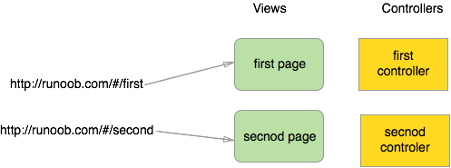

## 1. 简介

    AngularJS是一个JavaScript框架。它是一个以JavaScript编写的库。
    AngularJS是以一个JavaScript文件形式发布的，可通过script标签添加到网页中。
    ```
    <script src="libs/angular.min.js" ></script>
    ```

## 2. AngularJS使用
### 数据绑定
```
<!DOCTYPE html>
<html>
<head>
<meta charset="utf-8">
<script src="http://apps.bdimg.com/angular.js/1.4.6/angular.min.js"></script>
</head>
<body>
<div ng-app="">
  <p>名字: <input type="text" ng-model="name"> </p>
  <h1>Hello {{name}}
</div>
</body>
</html>
```
[示例](http://www.runoob.com/try/try.php?filename=try_ng_intro)
ng-app 指令告诉AngularJS,
元素是AngularJS应用程序的"所有者"。
ng-model指令是把输入域的值绑定到应用程序变量name。
ng-bind指令把应用程序变量name绑定到某个段落的innerHTML。

### AngularJS表达式
AngularJS表达式写在双大括号内:{{expression}}
AngularJS表达式把数据绑定到HTML，这与ng-bind指令有异曲同工之妙。
AngularJS将表达式书写的位置"输出"数据。
AngularJS表达式很像JavaScript表达式:它们可以包含文字、运算符和变量。

示例:
- [基本表达式](http://www.runoob.com/try/try.php?filename=try_ng_expression)
- [数组](http://www.runoob.com/try/try.php?filename=try_ng_expressions_arrays)
- [对象](http://www.runoob.com/try/try.php?filename=try_ng_bind_objects)
- [字符串](http://www.runoob.com/try/try.php?filename=try_ng_bind_strings)

类似于JavaScript表达式，AngularJS表达式可以包含字母、操作符、变量。

与JavaScript表达式不同，AngularJS表达式可以写在HTML中。

与JavaScript表达式不同，AngularJS表达式不支持条件判断、循环以及异常。

与JavaScript表达式不同，AngularJS表达式支持过滤器。

### AngularJS指令
AngularJS通过被称为指令的新属性来扩展HTML。

AngularJS通过内置的指令来为应用添加功能。

AngularJS允许你自定义指令。

AngularJS指令是扩展的HTML属性，带有前缀ng-

例如:

ng-app 指令初始化一个AngularJS应用程序。

ng-init 指令初始化应用程序数据。

ng-model 指令把元素值（比如输入域的值）绑定到应用程序。

[ng-repeat指令](http://www.runoob.com/try/try.php?filename=try_ng_repeat_array)

[自定义指令](http://www.runoob.com/try/try.php?filename=try_ng_directive_restrictions)

可以通过四种方式调用自定义指令
- 元素名
    ```
    <runoob-directive></runoob-directive>
    ```
- 属性
    ```
    <div runoob-directive></div>
    ```
- 注释
    ```
    <!-- 指令: runoob-directive -->
    ```
- 类名
    ```
    <div class="runoob-directive"></div>
    ```
可以通过设置restrict的值来限制调用的方式

restrict值可以是以下几种:

**E 只限元素名使用**

**A 只限属性使用**

**C 只限类名使用**

**M 只限注释使用**

restrict默认值为EA,即可以通过元素名和属性名来调用指令。

完整的指令列表: AngularJS参考手册

### 表单验证

[示例](http://www.runoob.com/try/try.php?filename=try_ng_validate)

HTML表单属性novalidate用于禁用浏览器默认的验证。

我们使用了ng-show指令

**$dirty 表单有填写记录**

**$valid 字段内容合法的**

**$invalid 字段内容是非法的**

**$pristine 表单没有填写记录**

### Angular Scope

- AngularJS应用组成如下：

    View(视图)，即HTML。

    Model(模型)，当前视图中可用的数据。

    Controller(控制器)，即JavaScript函数，可以添加或修改属性。

    Scope是模型。

    Scope是一个JavaScript对象，带有属性和方法，这些属性和方法可以在视图和控制器中使用。

    [示例](http://www.runoob.com/try/try.php?filename=try_ng_scope_sync)

- Scope作用范围

- 根作用域

    所有的应用都有一个$rootScope，它可以作用在ng-app指令包含的所有HTML元素中。

    $rootScope可作用于整个应用中。是各个controller中scope的桥梁。
    用rootscope定义的值，可以在各个controller中使用。

### Angular控制器

AngularJS控制器 控制AngularJS应用程序的数据。

ng-controller指令定义了应用程序控制器。

控制器是JavaScript对象，由标准的JavaScript对象的构造函数创建。

在控制器中可以定义属性和方法。

[示例](http://www.runoob.com/try/try.php?filename=try_ng_controller_property)

### Angular 过滤器
- 内置的一些过滤器

    currency，格式化数字为货币格式。

    filter，从数组项中选择一个子集。

    lowercase，格式化字符串为小写。

    orderby，根据某个表达式排列数组。

    uppercase，格式化字符串为大写。

- 表达式中添加过滤器

    过滤器可以通过一个管道字符(|)和一个过滤器添加到表达式中。

    例如:

    [uppercase过滤器](http://www.runoob.com/try/try.php?filename=try_ng_filters_uppercase)

    [currency过滤器](http://www.runoob.com/try/try.php?filename=try_ng_filters_currency)

### AngularJS服务
在AngularJS中，服务是一个函数或对象，可在你的AngularJS应用中使用。

AngularJS内建了30多个服务。
- 有个$location服务，它可以返回当前页面的URL地址。

    [location](http://www.runoob.com/try/try.php?filename=try_ng_services)

- $http是AngularJS应用中最常用的服务。服务向服务器发送请求，应用响应服务器传送过来的数据。

    [http](http://www.runoob.com/try/try.php?filename=try_ng_services_http)

- Restangular是AngularJS服务，简化常规的GET,POST,DELETE和UPDATE请求，使用更简短的代码。

    Restangular适用于所有WebApp,从RESTful API中消耗数据。

    [restangular](http://www.bootcdn.cn/restangular/readme/)

- $timeout服务

    AngularJS $timeout服务对应了JS window.setTimeout函数。

    [timeout](http://www.runoob.com/try/try.php?filename=try_ng_services_timeout)

### Angular事件
AngularJS有自己的HTML事件指令。

- ng-click指令

    [ng-click](http://www.runoob.com/try/try.php?filename=try_ng_events)

其他指令: ng-dbl-click、ng-mousedown、ng-mouseenter、ng-mouseleave、ng-mousemove、
         ng-keydown、  ng-keyup、    ng-keypress、  ng-change

### AngualarJS 全局API
AngularJS 全局API用于执行常见任务的JavaScript函数集合，如:

比较对象、迭代对象、转换对象

例如:

angular.lowercase() 转换字符串为小写

[lowercase](http://www.runoob.com/try/try.php?filename=try_ng_api_lowercase)

angular.uppercase() 转换字符串为大写

angular.isString() 判断给定的对象是否为字符串，如果是返回true

angular.isNumber() 判断给定的对象是否为数字，如果是返回true

[IsNumber](http://www.runoob.com/try/try.php?filename=try_ng_api_isnumber)

完整的API列表: [AngularJS参考手册](http://www.runoob.com/angularjs/angularjs-reference.html)

### AngularJS包含
使用AngularJS，你可以使用ng-include指令来包含HTML内容:

[include](http://www.runoob.com/try/try.php?filename=try_ng_includes)

### AngularJS 依赖注入
AngularJS提供很好的依赖注入机制。以下5个核心组件用来作为依赖注入:

value

factory

service

provider

constant

- value是一个简单的JavaScript对象，用于向控制器传递值(配置阶段)
    ```
     // 定义一个模块
    var mainApp = angular.module("mainApp", []);
    // 创建 value 对象 "defaultInput" 并传递数据
    mainApp.value("defaultInput", 5);
    ...
    // 将 "defaultInput" 注入到控制器
    mainApp.controller('CalcController', function($scope, CalcService, defaultInput) {
        $scope.number = defaultInput;
        $scope.result = CalcService.square($scope.number);
        $scope.square = function() {
            $scope.result = CalcService.square($scope.number);
        }
    });
    ```

[其他示例](http://www.runoob.com/try/try.php?filename=try_ng_dependency_injection)

[provider,service,factory区别](http://my.oschina.net/tanweijie/blog/295067)

### AngularJS 路由
AngularJS路由允许我们通过不同的URL访问不同的内容。

通过AngularJS可以实现多视图的单页Web应用(single page web application, SPA)。

通常我们的URL形式为[http://runoob.com/first/page](http://runoob.com/first/page)，但在单页Web应用中AngularJS通过`#+`标记实现，
例如:
```
http://runoob.com/#/first
http://runoob.com/#/second
http://runoob.com/#/third
```
当我们点击以上的任意一个链接时，向服务器请求的地址都是一样的(http://runoob.com/)。因为#号之后的内容在
向服务器请求时会被浏览器忽略掉。所以我们就需要在客户端实现`#`号后面内容的功能实现。

AngularJS路由就通过`#+`标记帮助我们区分不同的逻辑页面并将不同的页面绑定到对应的控制器上。

在以上图形中，我们可以看到创建了两个URL: /first和/second。每个URL都有对应的视图和控制器。

[示例](http://www.runoob.com/try/try.php?filename=try_ng_routing1&basepath=0)

1. 载入了实现路由的js文件: angular-route.js。

2. 包含了ngRoute模块作为主应用模块的依赖模块。

angular.module('routingDemoApp',['ngRoute']);

3. 使用ngView指令。

该div内的HTML内容会根据路由的变化而变化。

配置$routeProvider, AngularJS $routeProvider用来定义路由规则。
```
module.config(['\$routeProvider', function(\$routeProvider){
    $routeProvider
        .when('/',{template:'这是首页页面'})
        .when('/computers',{template:'这是电脑分类页面'})
        .when('/printers',{template:'这是打印机页面'})
        .otherwise({redirectTo:'/'});
}]);
```
AngularJS模块的config函数用于配置路由规则。通过使用configAPI，我们请求把$routeProvider注入到我们的配置函数并且使用$routeProvider.whenAPI来定义我们的路由规则。
$routeProvider为我们提供了when(path,object)&otherwise(object)函数按顺序定义所有路由，函数包含所有两个参数:

第一个参数是URL或者URL正则规则。

第二个参数是路由配置对象。

[参考资料](http://www.runoob.com/angularjs/angularjs-tutorial.html)
